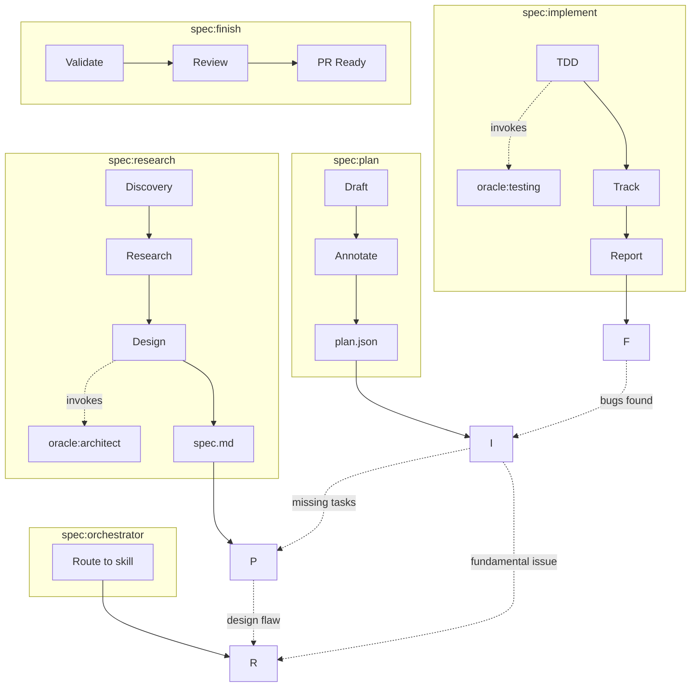

# AGENTS.md

This file provides guidance to AI agents when working with code in this repository.

## Repository Overview

This is Atelier - a personal development toolkit with 34 skills for spec-driven development, deep thinking, code quality, and ecosystem patterns.

## Skills Structure

Skills are located in the `skills/` directory. Each skill is a self-contained module with:

```
skills/{category}:{name}/
├── SKILL.md           # Main skill definition
└── references/        # Optional additional context
    ├── topic-a.md
    └── topic-b.md
```

### Skill File Format

Skills use YAML frontmatter for metadata:

```yaml
---
name: skill-name
description: When to use this skill (AI reads this to auto-load)
user-invocable: false  # or true if user can call directly
---
```

Skills are auto-invoked based on description match to current context.

## Namespace Philosophy

Skills are organized into three namespaces based on their role:

### spec: - Workflow Skills

Sequential, state-transforming steps that produce artifacts.

- **Process-oriented**: Each skill is a step in a workflow
- **User-invoked**: Called explicitly by user or previous skill
- **Artifact-producing**: Each produces a concrete output
- **Disciplined**: Must be followed exactly, not adapted

### oracle: - Thinking Skills

Analytical, knowledge-providing skills that inform decisions.

- **Knowledge-oriented**: Provide patterns, principles, guidance
- **Context-driven**: Auto-invoked when relevant context detected
- **Adaptable**: Principles adapted to specific situation
- **Supportive**: Inform workflow decisions, don't produce artifacts

### code: - Utility Skills

Tools and helpers for specific tasks.

- **Task-oriented**: Solve specific problems
- **User-invoked**: Called when needed
- **Standalone**: Can be used independently or within workflow

### Namespace Semantics

| Namespace | Type | Invocation | Output | Flexibility |
|-----------|------|------------|--------|-------------|
| spec: | Process | User/previous skill | Artifact | Follow exactly |
| oracle: | Knowledge | Context-driven | Guidance | Adapt to context |
| code: | Utility | User | Result | Use as needed |

## Skill Workflow



### Hard Transitions

| After completing... | The ONLY next step is... |
|---------------------|--------------------------|
| spec:research | spec:plan |
| spec:plan | spec:implement |
| spec:implement | spec:finish |

Do NOT jump from requirements to code. Do NOT jump from research to implementation.

### Iteration Patterns

The workflow is not purely linear. Expect backflows:

- **Plan → Research**: Planning reveals design assumptions are wrong
- **Implement → Plan**: Implementation reveals missing tasks
- **Implement → Research**: Implementation reveals fundamental design issue
- **Finish → Implement**: Validation finds bugs

If you loop 2+ times on the same issue, stop and ask the human:

> "We've looped on [issue] twice. Should we reconsider the approach?"

### Skill Types

**Process skills** (spec:research, spec:plan, spec:implement, spec:finish): Follow exactly.
Don't adapt away discipline.

**Knowledge skills** (oracle:architect, oracle:testing): Adapt principles to
context. These inform decisions within the workflow.

Process skills come first. Knowledge skills get invoked by process skills when needed.

## Available Skills

**Spec-Driven Development** (5 skills)
- `spec:finish` - Post-implementation validation
- `spec:implement` - Execute tasks from plan.json
- `spec:plan` - Implementation plan + tasks → plan.json
- `spec:research` - Discovery + research + architecture → spec.md
- `spec:orchestrator` - Skill routing and workflow orchestration

**Deep Thinking** (4 skills)
- `oracle:architect` - DDD patterns, component responsibilities
- `oracle:challenge` - Critical thinking and challenging approaches
- `oracle:testing` - TDD patterns, boundary testing
- `oracle:thinkdeep` - Extended sequential reasoning for complex problems

**TypeScript Patterns** (8 skills)
- `typescript:api-design` - REST API design patterns
- `typescript:build-tools` - Bun, Vitest, Biome, Turborepo
- `typescript:drizzle-orm` - Type-safe SQL for PostgreSQL/MySQL/SQLite/D1
- `typescript:dynamodb-toolbox` - Single-table design, GSI patterns
- `typescript:effect-ts` - Functional effects, error handling
- `typescript:fastify` - Fastify + TypeBox route handlers
- `typescript:functional-patterns` - ADTs, branded types, Option/Result
- `typescript:testing` - Mocking, MSW, snapshot testing

**Python Patterns** (8 skills)
- `python:architecture` - Functional core/imperative shell, DDD
- `python:build-tools` - uv, mise, ruff, basedpyright
- `python:fastapi` - Pydantic validation, dependency injection
- `python:modern-python` - Type hints, generics, async/await
- `python:monorepo` - uv workspaces, mise task orchestration
- `python:sqlalchemy` - ORM patterns, queries, async
- `python:temporal` - Workflow orchestration, activities
- `python:testing` - Stub-Driven TDD, layer boundary testing

## Installation

```bash
# Install all skills
npx skills add martinffx/atelier

# Install specific skill
npx skills add martinffx/atelier --skill typescript:drizzle-orm
```

## Development

For local development with Claude Code:

```bash
claude --plugin-dir ./atelier
```

Restart Claude Code after making changes to reload skills.
