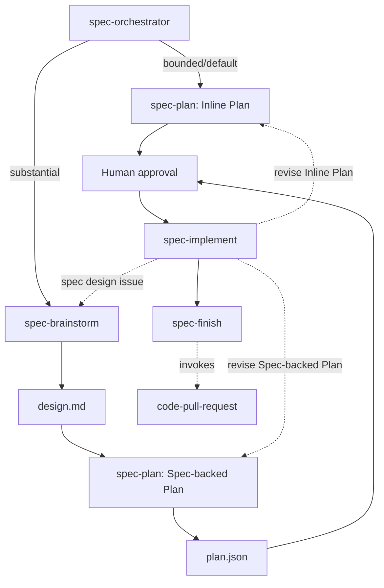

# AGENTS.md

This file provides guidance to AI agents when working with code in this repository.

## Repository Overview

This is Atelier - a personal development toolkit with 29 skills for spec-driven development, deep thinking, code quality, and ecosystem patterns.

## Skills Structure

Skills are located in the `skills/` directory. Each skill is a self-contained module with:

```
skills/{category}-{name}/
├── SKILL.md           # Main skill definition
└── references/        # Optional additional context
    ├── topic-a.md
    └── topic-b.md
```

### Skill File Format

Skills use YAML frontmatter for metadata:

```yaml
---
name: skill-name
description: When to use this skill (AI reads this to auto-load)
user-invocable: false  # or true if user can call directly
---
```

Skills are auto-invoked based on description match to current context.

## Namespace Philosophy

Skills are organized into three namespaces based on their role:

### spec: - Workflow Skills

Sequential, state-transforming steps that produce an approved plan and may produce artifacts.

- **Process-oriented**: Each skill is a step in a workflow
- **User-invoked**: Called explicitly by user or previous skill
- **Output-producing**: Each produces conversational or persisted output
- **Disciplined**: Must be followed exactly, not adapted

### oracle: - Thinking Skills

Analytical, knowledge-providing skills that inform decisions.

- **Knowledge-oriented**: Provide patterns, principles, guidance
- **Context-driven**: Auto-invoked when relevant context detected
- **Adaptable**: Principles adapted to specific situation
- **Supportive**: Inform workflow decisions, don't produce artifacts

### code: - Utility Skills

Tools and helpers for specific tasks.

- **Task-oriented**: Solve specific problems
- **User-invoked**: Called when needed
- **Standalone**: Can be used independently or within workflow

### Namespace Semantics

| Namespace | Type | Invocation | Output | Flexibility |
|-----------|------|------------|--------|-------------|
| spec: | Process | User/previous skill | Plan/artifact | Follow exactly |
| oracle: | Knowledge | Context-driven | Guidance | Adapt to context |
| code: | Utility | User | Result | Use as needed |

## Skill Workflow


```mermaid
graph TB
    O[spec-orchestrator] -->|bounded/default| PI[spec-plan: Inline Plan]
    O -->|substantial| B[spec-brainstorm]
    B --> D[design.md]
    D --> PS[spec-plan: Spec-backed Plan]
    PS --> J[plan.json]
    PI --> A[Human approval]
    J --> A
    A --> I[spec-implement]
    I --> F[spec-finish]
    F -.->|invokes| PR[code-pull-request]
    I -.->|revise Inline Plan| PI
    I -.->|revise Spec-backed Plan| PS
    I -.->|spec design issue| B
```

### Hard Transitions

| After completing... | Next step |
|---------------------|-----------|
| spec-brainstorm | spec-plan in Spec-backed mode |
| approved Inline Plan | spec-implement in Inline mode |
| approved Spec-backed Plan | spec-implement in Spec-backed mode |
| spec-implement | spec-finish |

Never write code before the human approves a written plan. Inline Plan is the default for
bounded work. Reserve `design.md` and `plan.json` for substantial work selected by
`spec-orchestrator` or explicitly requested by the human.

### Iteration Patterns

The workflow is not purely linear. Expect backflows:

- **Plan → Research**: Spec-backed planning reveals design assumptions are wrong
- **Implement → Plan**: Implementation requires an approved plan revision
- **Inline → Spec-backed**: Inline work develops durable design or coordination needs
- **Implement → Research**: Spec-backed implementation reveals a fundamental design issue
- **Finish → Implement**: Validation finds bugs

If you loop 2+ times on the same issue, stop and ask the human:

> "We've looped on [issue] twice. Should we reconsider the approach?"

### Skill Types

**Process skills** (spec-brainstorm, spec-plan, spec-implement, spec-finish): Follow exactly.
Don't adapt away discipline.

**Knowledge skills** (oracle-grill-me, oracle-domain-modelling): Adapt principles to
context. These inform decisions within the workflow.

**Discipline skills** (oracle-debug): Strict methodology that must be followed
exactly — no adaptation that bypasses root-cause investigation.

Process skills come first. Knowledge skills get invoked by process skills when needed.

## Available Skills

**Spec-Driven Development** (5 skills)
- `spec-finish` - Post-implementation validation
- `spec-implement` - Execute an approved Inline Plan or Spec-backed Plan
- `spec-plan` - Produce a conversational Inline Plan or persisted plan.json
- `spec-brainstorm` - Discovery + research + architecture for substantial work
- `spec-orchestrator` - Select planning mode and route the workflow

**Deep Thinking** (3 skills)
- `oracle-debug` - Systematic debugging, root cause before fixes
- `oracle-grill-me` - Socratic review of plans, specs, decisions, and ideas until ambiguity is resolved, shared understanding is reached, and the resulting domain language and decisions are recorded
- `oracle-domain-modelling` - Build and sharpen the project's domain model

**TypeScript Patterns** (8 skills)
- `typescript-api-design` - REST API design patterns
- `typescript-build-tools` - Bun, Vitest, Biome, Turborepo
- `typescript-drizzle-orm` - Type-safe SQL for PostgreSQL/MySQL/SQLite/D1
- `typescript-dynamodb-toolbox` - Single-table design, GSI patterns
- `typescript-effect-ts` - Functional effects, error handling
- `typescript-fastify` - Fastify + TypeBox route handlers
- `typescript-functional-patterns` - ADTs, branded types, Option/Result
- `typescript-testing` - Mocking, MSW, snapshot testing

**Python Patterns** (8 skills)
- `python-architecture` - Functional core/imperative shell, DDD
- `python-build-tools` - uv, mise, ruff, basedpyright
- `python-fastapi` - Pydantic validation, dependency injection
- `python-modern-python` - Type hints, generics, async/await
- `python-monorepo` - uv workspaces, mise task orchestration
- `python-sqlalchemy` - ORM patterns, queries, async
- `python-temporal` - Workflow orchestration, activities
- `python-testing` - Stub-Driven TDD, layer boundary testing

**Code Utilities** (5 skills)
- `code-commit` - Generate and validate conventional commits
- `code-handoff` - Compact conversation into handoff document for next agent
- `code-pull-request` - Create, comment on, and merge GitHub pull requests or GitLab merge requests
- `code-review` - Multi-agent code review with parallel reviewers
- `code-subagents` - Subagent dispatch patterns for implementation tasks

## Installation

```bash
# Install all skills
npx skills add martinffx/atelier

# Install specific skill
npx skills add martinffx/atelier --skill typescript-drizzle-orm
```

## Development

For local development with Claude Code:

```bash
claude --plugin-dir ./atelier
```

Restart Claude Code after making changes to reload skills.

<!-- BEGIN BEADS INTEGRATION v:1 profile:minimal hash:ca08a54f -->
## Beads Issue Tracker

This project uses **bd (beads)** for issue tracking. Run `bd prime` to see full workflow context and commands.

### Quick Reference

```bash
bd ready              # Find available work
bd show <id>          # View issue details
bd update <id> --claim  # Claim work
bd close <id>         # Complete work
```

### Rules

- When task tracking is useful, use `bd` instead of TodoWrite, TaskCreate, or markdown TODO lists
- Inline Plans do not create tracker entries
- Run `bd prime` for detailed command reference and session close protocol
- Use `bd remember` for persistent knowledge — do NOT use MEMORY.md files

## Session Completion

**When ending a work session**, you MUST complete ALL steps below. Work is NOT complete until `git push` succeeds.

**MANDATORY WORKFLOW:**

1. **File issues for remaining work** - Create issues for anything that needs follow-up
2. **Run quality gates** (if code changed) - Tests, linters, builds
3. **Update issue status** - Close finished work, update in-progress items
4. **PUSH TO REMOTE** - This is MANDATORY:
   ```bash
   git pull --rebase
   bd dolt push
   git push
   git status  # MUST show "up to date with origin"
   ```
5. **Clean up** - Clear stashes, prune remote branches
6. **Verify** - All changes committed AND pushed
7. **Hand off** - Provide context for next session

**CRITICAL RULES:**
- Work is NOT complete until `git push` succeeds
- NEVER stop before pushing - that leaves work stranded locally
- NEVER say "ready to push when you are" - YOU must push
- If push fails, resolve and retry until it succeeds
<!-- END BEADS INTEGRATION -->
