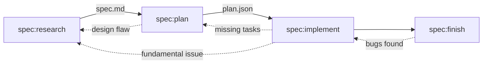

# Atelier


> An atelier is the private workshop or studio where a principal master and a number of assistants, students, and apprentices can work together producing fine art or visual art released under the master's name or supervision.
>
> [Wikipedia](https://en.wikipedia.org/wiki/Atelier)

A personal development toolkit for AI agents - spec-driven development, code quality, deep thinking, and ecosystem patterns.

## Skills

This repository includes 34 skills that can be installed via [skills.sh](https://skills.sh/). Skills are modular, auto-invoked capabilities that enhance AI agents with specialized knowledge and workflows.

### Installing Skills

```bash
# Install all skills from the repository
npx skills add martinffx/atelier

# Install specific skills
npx skills add martinffx/atelier --skill typescript:drizzle-orm
npx skills add martinffx/atelier --skill python:fastapi
npx skills add martinffx/atelier --skill spec:research
```

### Available Skills

**Spec-Driven Development**
- `spec:finish` - Post-implementation validation
- `spec:implement` - Execute tasks from plan.json
- `spec:plan` - Implementation plan + tasks → plan.json
- `spec:research` - Discovery + research + architecture → spec.md
- `spec:orchestrator` - Skill routing and workflow orchestration

**Deep Thinking**
- `oracle:architect` - DDD patterns, component responsibilities
- `oracle:challenge` - Critical thinking and challenging approaches
- `oracle:testing` - Stub-driven TDD and layer boundary testing
- `oracle:thinkdeep` - Extended sequential reasoning for complex problems

**TypeScript Patterns**
- `typescript:api-design` - REST API resource naming, HTTP methods, error responses, pagination
- `typescript:drizzle-orm` - Type-safe SQL for PostgreSQL/MySQL/SQLite/Cloudflare D1
- `typescript:dynamodb-toolbox` - Single-table design, entity definitions, GSI patterns
- `typescript:fastify` - Fastify + TypeBox route handlers and validation
- `typescript:functional-patterns` - ADTs, branded types, Option/Result, migration guide
- `typescript:effect-ts` - Functional effects, error handling, resources, schema, services
- `typescript:build-tools` - Bun, Vitest, Biome, Turborepo configurations
- `typescript:testing` - Mocking, MSW, snapshot testing

**Python Patterns**
- `python:architecture` - Functional core/imperative shell, DDD patterns, layered architecture
- `python:fastapi` - Pydantic validation, dependency injection, OpenAPI
- `python:sqlalchemy` - ORM patterns, queries, async, upserts
- `python:temporal` - Workflow orchestration, activities, error handling
- `python:modern-python` - Type hints, generics, async/await, pattern matching
- `python:monorepo` - uv workspaces, mise task orchestration, apps/packages
- `python:testing` - Stub-Driven TDD, layer boundary testing, pytest patterns
- `python:build-tools` - uv, mise, ruff, basedpyright, pytest configurations

Skills are auto-invoked based on their description when you work with relevant technologies. No commands needed - just install and AI agents will use them when appropriate.

## How Skills Work

Skills are auto-invoked based on context. When you say "create a spec for user auth", the AI matches this to `spec:research` and loads it automatically.

### Namespace Philosophy

Skills are organized into three namespaces based on their role:

| Namespace | Type | Invocation | Output | Flexibility |
|-----------|------|------------|--------|-------------|
| **spec:** | Workflow | User/previous skill | Artifact | Follow exactly |
| **oracle:** | Thinking | Context-driven | Guidance | Adapt to context |
| **code:** | Utility | User | Result | Use as needed |

- **spec:** - Sequential workflow steps that produce artifacts
- **oracle:** - Analytical skills that provide patterns and principles
- **code:** - Tools and utilities for specific tasks

### The Spec Workflow



**Standard flow:**
1. **Research** - Discovery + research + architecture → `spec.md`
2. **Plan** - Break into tasks → `plan.json`
3. **Implement** - Execute with TDD
4. **Finish** - Validate and review

**Iteration is normal** - Backflows (dotted lines) are expected when:
- Planning reveals design flaws → back to research
- Implementation finds missing tasks → update plan
- Validation finds bugs → back to implement

### When to Use Which Skill

| User says | Skill invoked |
|------------|---------------|
| "Create a spec for X" | spec:research |
| "What should we build" | spec:research |
| "Write a plan" | spec:plan |
| "Implement this" | spec:implement |
| "Review this code" | code:review |
| "Debug this" | code:debug |
| "How should I test this" | oracle:testing |
| "What's the architecture" | oracle:architect |

## Development

For local development, use the `--plugin-dir` flag to load skills directly:

```bash
claude --plugin-dir ./atelier
```

Restart Claude Code after making changes to reload skills.

## License

MIT Copyright (c) 2026 Martin Richards
