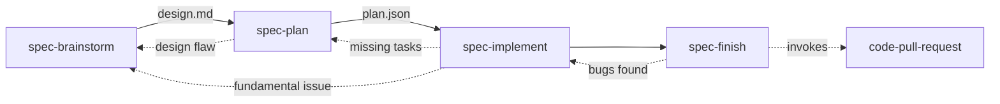

# Atelier


> An atelier is the private workshop or studio where a principal master and a number of assistants, students, and apprentices can work together producing fine art or visual art released under the master's name or supervision.
>
> [Wikipedia](https://en.wikipedia.org/wiki/Atelier)

A personal development toolkit for AI agents - spec-driven development, code quality, deep thinking, and ecosystem patterns.

Atelier ships as a set of skills installed via `npx skills` plus a small CLI that generates harness-native agent definitions and configuration.

## Quick Start

Install Atelier with a single command. It configures agents and harness-native settings for Claude Code, OpenCode, Codex, or Cursor:

```bash
# Initialize atelier for your harness
npx @martinffx/atelier@latest init --harness <claude|opencode|codex|cursor>

# Non-interactive mode (CI/CD)
npx @martinffx/atelier@latest init --harness <claude|opencode|codex|cursor> --yes
```

That's it. Your project is now configured for spec-driven development.

## What Gets Installed

Atelier sets up two things:

### 1. Skills (28 available)

Specialized knowledge modules that auto-invoke based on context. Install them separately:

```bash
npx skills add martinffx/atelier
```

### 2. Agent Personas (3 subagents)

Harness-agnostic agent definitions configured with appropriate models:

| Agent | Role | Claude | OpenCode | Codex | Cursor |
|-------|------|--------|----------|-------|--------|
| **Recon** | Fast codebase reconnaissance | haiku | deepseek-v4-flash | gpt-5.6-luna | composer-2.5 |
| **Oracle** | Strategic thinking, requirements, analysis | opus | kimi-k2.6 | gpt-5.6-sol | claude-opus-4-8-high |
| **Architect** | DDD, system design, architecture | opus | deepseek-v4-pro | gpt-5.6-sol | gpt-5.6-sol-medium |

Agents are generated into harness-specific locations (`.claude/agents/`, `.opencode/agent/`, `.codex/agents/`, `~/.cursor/agents/`) with harness-native model identifiers. Cursor's primary model and `~/.cursor/cli-config.json` remain user-managed; Atelier only generates its three global subagents.

### 3. Task Tracking (optional)

The spec workflow skills support **beads** for dependency-aware task tracking:

```bash
# Install beads (optional but recommended)
npm install -g beads
```

**Why beads?** It provides `bd ready` (finds next unblocked task), `bd dep add` (dependency management), and `bd list` (progress tracking) that harness-native todos can't match.

**Fallback:** If beads isn't installed, skills fall back to the harness's native todo system (TodoWrite for Claude Code, built-in todos for OpenCode).

### 4. Configuration

Single source of truth in `.atelier/config.json`:

```json
{
  "version": "1.0.0",
  "skills_source": "martinffx/atelier",
  "skills_path": "~/.agents/skills",
  "claude": {
    "provider": "anthropic",
    "default_model": "opusplan",
    "agents": [
      { "template": "recon", "name": "recon", "model": "haiku" },
      { "template": "oracle", "name": "oracle", "model": "opus" },
      { "template": "architect", "name": "architect", "model": "opus" }
    ]
  }
}
```

## CLI Commands

### `init` (default)

Initialize atelier for a single harness. Each invocation configures one harness; run it multiple times to configure several.

```bash
npx @martinffx/atelier@latest init --harness <claude|opencode|codex|cursor> [options]
```

**Options:**
- `--harness <type>` - Harness type (`claude`, `opencode`, `codex`, or `cursor`)
- `--yes` - Non-interactive mode with default models

**Idempotent**: Re-running `init` for the same harness is safe. It regenerates files without deleting anything unless you switch harnesses.

### `update`

Refresh agents and harness-native config for one harness without touching skills:

```bash
npx @martinffx/atelier@latest update --harness <claude|opencode|codex|cursor>
```

### `remove`

Remove all atelier-generated files for one harness:

```bash
npx @martinffx/atelier@latest remove --harness <claude|opencode|codex|cursor>
```

Skills remain installed. Run `npx skills remove martinffx/atelier` to remove them separately.

## Skills

This repository includes 28 skills that enhance AI agents with specialized knowledge and workflows.

### Installing Skills

Install skills manually:

```bash
# Install all skills
npx skills add martinffx/atelier

# Install specific skills
npx skills add martinffx/atelier --skill typescript-drizzle-orm
npx skills add martinffx/atelier --skill python-fastapi
npx skills add martinffx/atelier --skill spec-brainstorm
```

### Skill Types

Skills fall into four categories based on what they do:

#### Workflow Skills (`spec:*`)

Process-oriented skills that guide you through structured development workflows. These produce artifacts and should be followed step-by-step.

- `spec-brainstorm` → `design.md` — Discovery, requirements, architecture
- `spec-plan` → `plan.json` — Break spec into implementable tasks
- `spec-implement` — Execute tasks with TDD
- `spec-finish` — Validate, review, prepare for PR
- `spec-orchestrator` — Route to the right skill based on context

#### Thinking Skills (`oracle:*`)

Analytical skills that provide patterns, principles, and deep reasoning. These adapt to your specific situation.

- `oracle-debug` — Systematic debugging, root cause before fixes
- `oracle-grill-me` — Socratic interrogation of plans against domain model
- `oracle-domain-modelling` — Build and sharpen the project's domain model

#### Domain Knowledge (`python:*`, `typescript:*`)

Technology-specific patterns and best practices. These are like having a senior engineer for that stack.

**TypeScript (8 skills)**
- `typescript-api-design` — REST conventions, error responses, pagination
- `typescript-fastify` — Fastify + TypeBox route handlers
- `typescript-drizzle-orm` — Type-safe SQL schemas and queries
- `typescript-dynamodb-toolbox` — Single-table design, GSIs
- `typescript-functional-patterns` — ADTs, branded types, Option/Result
- `typescript-effect-ts` — Functional effects, error handling, resources
- `typescript-build-tools` — Bun, Vitest, Biome, Turborepo
- `typescript-testing` — Mocking, MSW, snapshot testing

**Python (8 skills)**
- `python-architecture` — Functional core/shell, DDD, layered architecture
- `python-fastapi` — Pydantic validation, dependency injection, OpenAPI
- `python-sqlalchemy` — ORM patterns, queries, async, upserts
- `python-temporal` — Workflow orchestration, activities, error handling
- `python-modern-python` — Type hints, generics, pattern matching
- `python-monorepo` — uv workspaces, mise task orchestration
- `python-testing` — Stub-driven TDD, pytest patterns
- `python-build-tools` — uv, ruff, basedpyright, pytest config

#### Utility Skills (`code:*`)

Task-specific tools you invoke when you need them.

- `code-commit` — Generate and validate conventional commits
- `code-handoff` — Compact conversation into handoff document
- `code-pull-request` — Create, comment on, and merge GitHub pull requests or GitLab merge requests
- `code-review` — Multi-agent code review with specialized reviewers
- `code-subagents` — Dispatch patterns for parallel implementation

Skills are auto-invoked based on their description when you work with relevant technologies. No commands needed—just install and AI agents will use them when appropriate.

## How Skills Work

Skills are auto-invoked based on context. When you say "create a spec for user auth", the AI matches this to `spec-brainstorm` and loads it automatically.

### Namespace Philosophy

Skills are organized into four categories based on their role:

| Category | Prefix | Type | Invocation | Output | Flexibility |
|----------|--------|------|------------|--------|-------------|
| **Workflow** | `spec:` | Process | User/previous skill | Artifact | Follow exactly |
| **Thinking** | `oracle:` | Analytical | Context-driven | Guidance | Adapt to context |
| **Domain Knowledge** | `python:`, `typescript:` | Technology | Context-driven | Patterns | Adapt to context |
| **Utility** | `code:` | Task-specific | User command | Result | Use as needed |

- **Workflow** (`spec:`) — Sequential steps that produce artifacts. Follow them in order.
- **Thinking** (`oracle:`) — Analytical capabilities that reason about your specific problem.
- **Domain Knowledge** (`python-*`, `typescript-*`) — Stack-specific patterns and best practices. Like having a senior engineer for that technology.
- **Utility** (`code:`) — Task-specific tools you invoke directly when needed.

### The Spec Workflow



**Standard flow:**
1. **Research** - Discovery + research + architecture → `design.md`
2. **Plan** - Break into tasks → `plan.json`
3. **Implement** - Execute with TDD
4. **Finish** - Validate, review, and open the PR

**Iteration is normal** - Backflows (dotted lines) are expected when:
- Planning reveals design flaws → back to research
- Implementation finds missing tasks → update plan
- Validation finds bugs → back to implement

### When to Use Which Skill

| User says | Skill invoked |
|------------|---------------|
| "Create a spec for X" | spec-brainstorm |
| "What should we build" | spec-brainstorm |
| "Write a plan" | spec-plan |
| "Implement this" | spec-implement |
| "Review this code" | code-review |
| "Open a PR" | code-pull-request |
| "Merge this PR" | code-pull-request |
| "Read PR comments" | code-pull-request |
| "Leave a comment on the PR" | code-pull-request |
| "Debug this" | oracle-debug |

## Development

For local development with Claude Code, use the `--plugin-dir` flag to load skills directly:

```bash
claude --plugin-dir ./atelier
```

Restart Claude Code after making changes to reload skills.

To work on the CLI itself:

```bash
# Build the CLI
bun run build

# Test locally
bun ./dist/atelier.js init --yes
```

## License

MIT Copyright (c) 2026 Martin Richards
