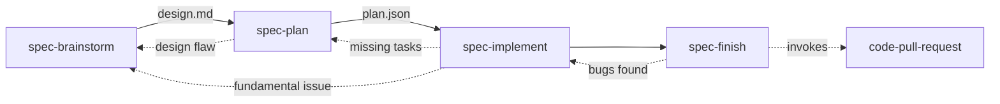

# Atelier


> An atelier is the private workshop or studio where a principal master and a number of assistants, students, and apprentices can work together producing fine art or visual art released under the master's name or supervision.
>
> [Wikipedia](https://en.wikipedia.org/wiki/Atelier)

A personal development toolkit for AI agents. It covers spec-driven development, code quality, deep thinking, and ecosystem patterns.

Atelier includes skills installed with `npx skills` and a small CLI for generating agent definitions and configuration for supported harnesses.

## Quick start

Install Atelier, then choose the harness you use. The CLI configures agents and harness-native settings for Claude Code, OpenCode, Codex, and Cursor.

```bash
# Initialize atelier for your harness
npx @martinffx/atelier@latest init --harness <claude|opencode|codex|cursor>

# Non-interactive mode (CI/CD)
npx @martinffx/atelier@latest init --harness <claude|opencode|codex|cursor> --yes
```

Your project is ready to use the spec workflow.

## Rationale and inspiration

Coding agents are more useful when they know a project's conventions, patterns, preferences, and quality bar. Atelier is my way of recording that context as reusable skills and workflows. Models remain unpredictable, but a deliberate method makes good results more repeatable. [Building Your Own Agent Harness](https://www.martinrichards.me/post/building_your_own_agent_harness/) explains the thinking behind it.

The name is literal. An atelier is a workshop where a principal works with assistants. Here, the developer is the principal, agents are the assistants, the codebase is the workshop, and skills record how the work happens.

Atelier draws on spec-driven development and several projects that informed its approach to agent collaboration:

- [Agent OS](https://github.com/buildermethods/agent-os) for discovering project standards and shaping lightweight specs.
- [OpenSpec](https://github.com/Fission-AI/OpenSpec) for fluid, artifact-guided workflows that support iteration and brownfield development.
- [GitHub Spec Kit](https://github.com/github/spec-kit) for making specifications central to a structured specify, plan, tasks, and implement workflow.
- [Superpowers](https://github.com/obra/superpowers) for composable skills, mandatory engineering workflows, TDD, and evidence-based verification.
- [Matt Pocock's Skills](https://github.com/mattpocock/skills) for small, adaptable skills grounded in practical engineering and developer control.

Some Atelier skills have more direct lineage:

| Atelier skill | Source skill | Relationship |
|---------------|--------------|--------------|
| [`spec-orchestrator`](skills/spec-orchestrator/SKILL.md) | Superpowers [`using-superpowers`](https://github.com/obra/superpowers/tree/main/skills/using-superpowers) | Adapted from its mandatory skill-routing discipline. |
| [`spec-brainstorm`](skills/spec-brainstorm/SKILL.md) | Superpowers [`brainstorming`](https://github.com/obra/superpowers/tree/main/skills/brainstorming) | Adapted from its conversational discovery and section-by-section design approval. |
| [`spec-plan`](skills/spec-plan/SKILL.md) | Superpowers [`writing-plans`](https://github.com/obra/superpowers/tree/main/skills/writing-plans) | Inspired by its explicit, verifiable implementation plans. |
| [`spec-implement`](skills/spec-implement/SKILL.md) | Superpowers [`executing-plans`](https://github.com/obra/superpowers/tree/main/skills/executing-plans) and [`test-driven-development`](https://github.com/obra/superpowers/tree/main/skills/test-driven-development) | Inspired by plan-driven execution and test-first feedback loops. |
| [`spec-finish`](skills/spec-finish/SKILL.md) | Superpowers [`finishing-a-development-branch`](https://github.com/obra/superpowers/tree/main/skills/finishing-a-development-branch) and [`verification-before-completion`](https://github.com/obra/superpowers/tree/main/skills/verification-before-completion) | Inspired by its validation and completion workflow. |
| [`code-subagents`](skills/code-subagents/SKILL.md) | Superpowers [`subagent-driven-development`](https://github.com/obra/superpowers/tree/main/skills/subagent-driven-development) and [`dispatching-parallel-agents`](https://github.com/obra/superpowers/tree/main/skills/dispatching-parallel-agents) | Inspired by fresh subagents, parallel dispatch, and two-stage review. |
| [`code-handoff`](skills/code-handoff/SKILL.md) | Matt Pocock's [`handoff`](https://github.com/mattpocock/skills/tree/main/skills/productivity/handoff) | Adapted from its context-preserving handoff format. |
| [`oracle-grill-me`](skills/oracle-grill-me/SKILL.md) | Matt Pocock's [`grilling`](https://github.com/mattpocock/skills/tree/main/skills/productivity/grilling) and [`grill-with-docs`](https://github.com/mattpocock/skills/tree/main/skills/engineering/grill-with-docs) | Adapted from its rigorous interview loop and integration with living domain documentation. |
| [`oracle-domain-modelling`](skills/oracle-domain-modelling/SKILL.md) | Matt Pocock's [`domain-modeling`](https://github.com/mattpocock/skills/tree/main/skills/engineering/domain-modeling) | Adapted from its active domain-modelling discipline, `CONTEXT.md`, and lightweight ADRs. |
| [`oracle-debug`](skills/oracle-debug/SKILL.md) | Superpowers [`systematic-debugging`](https://github.com/obra/superpowers/tree/main/skills/systematic-debugging) and Matt Pocock's [`diagnosing-bugs`](https://github.com/mattpocock/skills/tree/main/skills/engineering/diagnosing-bugs) | Adapted from their root-cause-first debugging workflows. |

Elsewhere, [`typescript-functional-patterns`](skills/typescript-functional-patterns/SKILL.md) draws on Rastrian's [Why Reliability Demands Functional Programming, ADTs, Safety and Critical Infrastructure](https://blog.rastrian.dev/post/why-reliability-demands-functional-programming-adts-safety-and-critical-infrastructure), and [`code-commit`](skills/code-commit/SKILL.md) follows the [Conventional Commits](https://www.conventionalcommits.org/) specification.

Atelier adapts these ideas into an opinionated toolkit that works across harnesses. It does not claim to have invented the practices it uses.

## What gets installed

Atelier sets up the following:

### 1. Skills (29 available)

Skills are specialized knowledge modules that load when their context applies. Install them separately:

```bash
npx skills add martinffx/atelier
```

### 2. Agent personas (3 subagents)

Agent definitions are generated for each supported harness with appropriate models:

| Agent | Role | Claude | OpenCode | Codex | Cursor |
|-------|------|--------|----------|-------|--------|
| **Recon** | Fast codebase reconnaissance | haiku | deepseek-v4-flash | gpt-5.6-luna | composer-2.5 |
| **Oracle** | Strategic thinking, requirements, analysis | opus | kimi-k2.6 | gpt-5.6-sol | claude-opus-4-8-high |
| **Architect** | DDD, system design, architecture | opus | deepseek-v4-pro | gpt-5.6-sol | gpt-5.6-sol-medium |

The CLI writes agents to harness-specific locations: `.claude/agents/`, `.opencode/agent/`, `.codex/agents/`, or `~/.cursor/agents/`. It uses each harness's model identifiers. Cursor's primary model and `~/.cursor/cli-config.json` remain user-managed. Atelier only creates its three global subagents.

### 3. Task tracking (optional)

The spec workflow can use **beads** for dependency-aware task tracking:

```bash
# Install beads (optional but recommended)
npm install -g beads
```

Beads provides `bd ready` to find unblocked tasks, `bd dep add` to manage dependencies, and `bd list` to show progress. Harness-native todo systems do not provide the same dependency support.

If beads is unavailable, skills use the harness's native todo system: TodoWrite for Claude Code or built-in todos for OpenCode.

### 4. Configuration

Single source of truth in `.atelier/config.json`:

```json
{
  "version": "1.0.0",
  "skills_source": "martinffx/atelier",
  "skills_path": "~/.agents/skills",
  "claude": {
    "provider": "anthropic",
    "default_model": "opusplan",
    "agents": [
      { "template": "recon", "name": "recon", "model": "haiku" },
      { "template": "oracle", "name": "oracle", "model": "opus" },
      { "template": "architect", "name": "architect", "model": "opus" }
    ]
  }
}
```

## CLI commands

### `init` (default)

Initialize Atelier for one harness. Run the command again for each additional harness.

```bash
npx @martinffx/atelier@latest init --harness <claude|opencode|codex|cursor> [options]
```

Options:
- `--harness <type>` - Harness type (`claude`, `opencode`, `codex`, or `cursor`)
- `--yes` - Non-interactive mode with default models

You can safely re-run `init` for the same harness. It regenerates its files and does not delete existing files unless you switch harnesses.

### `update`

Refresh agents and harness-native config for one harness without touching skills:

```bash
npx @martinffx/atelier@latest update --harness <claude|opencode|codex|cursor>
```

### `remove`

Remove all atelier-generated files for one harness:

```bash
npx @martinffx/atelier@latest remove --harness <claude|opencode|codex|cursor>
```

Skills remain installed. Run `npx skills remove martinffx/atelier` to remove them separately.

## Skills

This repository includes 29 skills for agent workflows and stack-specific guidance.

### Installing skills

Install skills manually:

```bash
# Install all skills
npx skills add martinffx/atelier

# Install specific skills
npx skills add martinffx/atelier --skill typescript-drizzle-orm
npx skills add martinffx/atelier --skill python-fastapi
npx skills add martinffx/atelier --skill spec-brainstorm
```

### Skill types

Skills fall into four groups:

#### Workflow skills (`spec:*`)

These skills guide structured development work. They produce artifacts and should be used in order.

- `spec-brainstorm` → `design.md`: discovery, requirements, and architecture
- `spec-plan` → `plan.json`: break the design into implementable tasks
- `spec-implement`: execute tasks with TDD
- `spec-finish`: validate, review, and prepare for a PR
- `spec-orchestrator`: route work to the right skill

#### Thinking skills (`oracle:*`)

These skills provide analytical methods and reasoning patterns that adapt to the problem at hand.

- `oracle-debug`: systematic debugging that finds the root cause before a fix
- `oracle-grill-me`: Socratic review of plans against the domain model
- `oracle-domain-modelling`: build and refine the project's domain model

#### Domain knowledge (`python:*`, `typescript:*`)

These skills cover technology-specific patterns and practices.

**TypeScript (8 skills)**
- `typescript-api-design`: REST conventions, error responses, and pagination
- `typescript-fastify`: Fastify and TypeBox route handlers
- `typescript-drizzle-orm`: type-safe SQL schemas and queries
- `typescript-dynamodb-toolbox`: single-table design and GSIs
- `typescript-functional-patterns`: ADTs, branded types, and Option/Result
- `typescript-effect-ts`: functional effects, error handling, and resources
- `typescript-build-tools`: Bun, Vitest, Biome, and Turborepo
- `typescript-testing`: mocking, MSW, and snapshot testing

**Python (8 skills)**
- `python-architecture`: functional core/shell, DDD, and layered architecture
- `python-fastapi`: Pydantic validation, dependency injection, and OpenAPI
- `python-sqlalchemy`: ORM patterns, queries, async, and upserts
- `python-temporal`: workflow orchestration, activities, and error handling
- `python-modern-python`: type hints, generics, and pattern matching
- `python-monorepo`: uv workspaces and mise task orchestration
- `python-testing`: stub-driven TDD and pytest patterns
- `python-build-tools`: uv, ruff, basedpyright, and pytest configuration

#### Utility skills (`code:*`)

These skills handle discrete tasks when you invoke them.

- `code-commit`: generate and validate conventional commits
- `code-handoff`: turn a conversation into a handoff document
- `code-pull-request`: create, comment on, and merge GitHub pull requests or GitLab merge requests
- `code-review`: multi-agent code review with specialized reviewers
- `code-subagents`: dispatch patterns for parallel implementation

Skills load based on their descriptions when the work calls for them. Install them once, then agents can use them as needed.

## How skills work

Skills load from context. For example, "create a spec for user auth" matches `spec-brainstorm`.

### Namespace philosophy

Skills are grouped by role:

| Category | Prefix | Type | Invocation | Output | Flexibility |
|----------|--------|------|------------|--------|-------------|
| **Workflow** | `spec:` | Process | User/previous skill | Artifact | Follow exactly |
| **Thinking** | `oracle:` | Analytical | Context-driven | Guidance | Adapt to context |
| **Domain Knowledge** | `python:`, `typescript:` | Technology | Context-driven | Patterns | Adapt to context |
| **Utility** | `code:` | Task-specific | User command | Result | Use as needed |

- **Workflow** (`spec:`): sequential steps that produce artifacts. Use them in order.
- **Thinking** (`oracle:`): analytical methods for the problem in front of you.
- **Domain Knowledge** (`python-*`, `typescript-*`): stack-specific patterns and practices.
- **Utility** (`code:`): tools for tasks you invoke directly.

### The spec workflow



Standard flow:
1. **Research**: discovery, research, and architecture produce `design.md`.
2. **Plan**: break the design into tasks in `plan.json`.
3. **Implement**: execute the tasks with TDD.
4. **Finish**: validate the work, review it, and open the PR.

The dotted lines show expected backflows:
- Planning may expose a design flaw, so return to research.
- Implementation may uncover missing tasks, so update the plan.
- Validation may find bugs, so return to implementation.

### When to use which skill

| User says | Skill invoked |
|------------|---------------|
| "Create a spec for X" | spec-brainstorm |
| "What should we build" | spec-brainstorm |
| "Write a plan" | spec-plan |
| "Implement this" | spec-implement |
| "Review this code" | code-review |
| "Open a PR" | code-pull-request |
| "Merge this PR" | code-pull-request |
| "Read PR comments" | code-pull-request |
| "Leave a comment on the PR" | code-pull-request |
| "Debug this" | oracle-debug |

## Development

For local development with Claude Code, load skills directly with `--plugin-dir`:

```bash
claude --plugin-dir ./atelier
```

Restart Claude Code after making changes to reload skills.

To work on the CLI itself:

```bash
# Build the CLI
bun run build

# Test locally
bun ./dist/atelier.js init --yes
```

## License

MIT Copyright (c) 2026 Martin Richards
