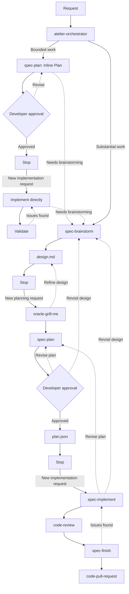

# Atelier


> A personal development toolkit for AI agents. It covers spec-driven development, code quality, and deep thinking.

Atelier gives coding agents a disciplined way to move from an idea to reviewed, verified code without taking control away from the developer.

```bash
npx @martinffx/atelier@latest init --harness <claude|opencode|codex|cursor>
```

Install the skills separately:

```bash
npx skills add martinffx/atelier
```

Update installed skills with:

```bash
npx skills update martinffx/atelier
```

For OpenCode, installing skills first also creates slash commands for every installed skill
marked `user-invocable: true`. If you initialized OpenCode before installing the skills, run:

```bash
npx @martinffx/atelier@latest update --harness opencode
```

## How Atelier works

Atelier uses as much process as each request needs. Bounded work gets a concise plan in the conversation. Substantial work gets a durable spec, an implementation plan, and tracked execution. The developer approves the plan before implementation begins.


```mermaid
flowchart TD
    R[Request] --> O[atelier-orchestrator]

    O -->|Bounded work| IP[spec-plan: Inline Plan]
    IP --> IA{Developer approval}
    IA -->|Approved| IS[Stop]
    IA -.->|Revise| IP

    IS -->|New implementation request| I[Implement directly]
    I --> V[Validate]
    V -.->|Issues found| I
    IP -.->|Needs brainstorming| B
    I -.->|Needs brainstorming| B

    O -->|Substantial work| B[spec-brainstorm]
    B --> D[design.md]
    D --> BS[Stop]
    BS -->|New planning request| G[oracle-grill-me]
    G --> P[spec-plan]
    G -.->|Refine design| D
    P --> SA{Developer approval}
    SA -->|Approved| J[plan.json]
    SA -.->|Revise plan| P
    SA -.->|Revisit design| B
    J --> PS[Stop]
    PS -->|New implementation request| SI[spec-implement]
    SI --> CR[code-review]
    CR --> F[spec-finish]
    F --> PR[code-pull-request]
    SI -.->|Revise plan| P
    SI -.->|Revisit design| B
    F -.->|Issues found| SI
```

The workflow is deliberately harder to rush than an unstructured agent session. `spec-brainstorm` writes only `design.md`, and `spec-plan` writes only its selected plan output. Each skill then stops. The developer starts planning and implementation with separate requests. This records decisions when they need to survive the conversation, keeps implementation tied to an approved plan, and requires evidence before calling the work complete.

Before a plan is presented, `spec-plan` runs a design review and a critical challenge as parallel subagents and notes what changed. During implementation, `spec-implement` hands tasks whose design is already settled to a subagent, keeping design-sensitive work in the main thread. Which agent handles each step is left to the harness.

## Grill the idea

[`oracle-grill-me`](skills/oracle-grill-me/SKILL.md) interviews you one question at a time until the important decisions are explicit. It researches facts from the codebase instead of asking you to supply them, gives a recommended answer for each decision, and leaves the final choice with you.

As the discussion resolves, it maintains the project's domain language and architectural decisions. Use it on a proposal, plan, migration, or design that feels settled a little too quickly.

```text
Grill me on this migration plan
```

## Review the code

[`code-review`](skills/code-review/SKILL.md) runs a multi-agent review rather than asking one agent for a general opinion. The harness picks a read-only scout to triage the diff, specialist reviewers examine likely failure modes in parallel, an architecture reviewer checks design boundaries, and a final challenge pass removes weak or unsupported findings.

```text
rq             # Review the diff to main
rq develop     # Review against another branch
rs             # Work through the findings
```

It reports findings before changing code. You decide which fixes to apply.

## What you get

Atelier installs a focused set of skills for the full development loop:

| Area | Capabilities |
|------|--------------|
| Spec workflow | Discovery, research, planning, implementation, validation, and finishing |
| Thinking | Root-cause debugging, decision grilling, domain modelling, and codebase design |
| Delivery | Multi-agent review, subagent coordination, commits, handoffs, and pull requests |

The CLI also configures four specialist agents for Claude Code, OpenCode, Codex, or Cursor:

| Agent | Role |
|-------|------|
| **Sentinel** | Read-only codebase reconnaissance and review triage |
| **Oracle** | Requirements, trade-offs, and critical analysis of changes |
| **Architect** | Domain modelling, system design, and architecture review |
| **Keymaker** | Fast scaffolding of files and boilerplate from templates and existing patterns |

The harness picks an agent by matching the task to its description, so workflows never name one. Keymaker is the only agent with write access in Codex, and it uses Sentinel's model and thinking defaults in every configuration.

Run `npx @martinffx/atelier@latest --help` for CLI commands and options. Each skill contains its own operating instructions and loads when its context applies.

## Models and thinking

New configurations use the following defaults (September 2026). Each entry is **model / thinking**.

| Configuration | Sentinel | Oracle | Architect | Plan | Build |
|---|---|---|---|---|---|
| Claude Code | Haiku 5.5 / default | Opus 5.5 / xhigh | Opus 5.5 / high | Opus 5.5 / high | Sonnet 5 / high |
| Codex | Luna 6 / low | Astra 6 / high | Astra 6 / xhigh | Sol 6 / xhigh | Sol 6 / high |
| OpenCode / OpenAI | Luna 6 / low | Astra 6 / high | Astra 6 / xhigh | Astra 6 / xhigh | Sol 6 / high |
| OpenCode / Bedrock | Haiku 4.5 / default | Fable 5.1 / high | Opus 5.5 / high | Opus 5.5 / high | Sonnet 5 / high |
| OpenCode / Zen | GLM 5.3 Flash / low | Kimi K3 / high | GLM 5.3 / high | GLM 5.3 / high | DeepSeek V4.1 Flash / high |
| OpenCode / Go | GLM 5.3 Flash / low | MiMo V2.6 Pro / on | GLM 5.3 / high | GLM 5.3 / high | DeepSeek V4.1 Flash / high |

Sentinel favors inexpensive reconnaissance. Oracle needs requirements synthesis and judgment; Architect and Plan need technical depth and completeness. Build balances capability and execution cost. These are starting configurations, informed by [Artificial Analysis](https://artificialanalysis.ai/models), rather than measured winners for Atelier's specific roles. Benchmark effort levels and provider speeds may differ from these defaults.

Kimi's long-context results motivate its Oracle assignment on Zen. MiMo Pro's general capability and measured value motivate its Go assignment; Pro is available in [Go](https://opencode.ai/docs/go/) but absent from the researched [Zen catalog](https://opencode.ai/docs/zen/). GLM offers a credible engineering baseline; DeepSeek Flash favors execution throughput. Qwen, MiniMax, and other available candidates remain selectable. Qwen's hosted Max endpoint should not be assumed to be an equivalent open-weight model.

Run `atelier update --harness <claude|codex|opencode>` to choose models and thinking settings. Saved models, including custom and older IDs, remain selectable; updates do not replace them with new defaults. Switching OpenCode providers starts from that provider's defaults. Cursor's configuration is unchanged.

Thinking is stored as `agents[].thinking`, `build_thinking`, and `plan_thinking` in `~/.atelier/config.json`. Values are model-specific: `default`, `off`, `on`, `low`, `medium`, `high`, `xhigh`, or `max`. The picker offers only verified capabilities. Custom models and catalog models whose controls have not been verified offer `default` only. Missing fields preserve legacy behavior; **Keep existing behavior** preserves that omission when editing. In particular, old Codex configurations retain medium agent/Build effort and high Plan effort. An explicit `default` omits Atelier's native effort override; other harness settings can still apply.

- **Claude Code:** `opusplan` switches Opus/Sonnet by mode. Other session models share one thinking setting across modes. Atelier writes canonical `modelSettings.<model>.effortLevel` entries and subagent `effort`. Session `max` cannot be persisted, though supported subagents can use it. Use Claude Code **2.1.280 or later** for Opus 5.5 and the current aliases. Atelier also sets `disableClaudeAiConnectors: true`, `syncClaudeAiSkills: false` and `syncClaudeAiPlugins: false` in `~/.claude/settings.json`, so nothing from claude.ai is synced into Claude Code; `atelier remove` clears them unless you changed them. [Claude configuration](https://code.claude.com/docs/en/model-config)
- **Codex:** Plan and Build share the selected session model, with separate reasoning settings. Oracle and Architect use independent Astra configurations. `off` maps to native `none`, available on Sol/Luna but not Astra. [Codex configuration](https://developers.openai.com/codex/config-reference/)
- **OpenCode:** all five assignments are independent. Use **1.18.30 or later** for GPT-6 integration. Atelier sends explicit provider options rather than relying on automatically discovered reasoning variants: `reasoningEffort` for OpenAI-compatible routes, `effort` for Anthropic, and `reasoningConfig` for Bedrock. GLM 5.3 supports low/high/max; it does not support medium. Bedrock defaults use US inference profiles with `us-east-1`. [OpenCode agents](https://opencode.ai/docs/agents/)
- **MiMo:** `on`/`off` maps to `thinking.type: enabled`/`disabled`. There are no graded effort tiers. OpenCode agent files omit the old fixed temperature override so provider defaults apply. [MiMo API](https://mimo.mi.com/docs/en-US/api/chat/openai-api)

Atelier does not upgrade installed harness CLIs. Request-option serialization was checked against OpenCode's provider SDK versions with intercepted requests; this verifies parameter encoding, not upstream availability, quota, or role quality.

## Ecosystem

Language-specific guidance lives in companion repositories:

- [Python skills](https://github.com/martinffx/python-skills)
- [TypeScript skills](https://github.com/martinffx/typescript-skills)

## Rationale and inspiration

Better models alone do not produce better software. Coding agents, like human teams, are shaped by the systems they work within. Good outcomes depend on more than individual ability. They depend on the processes, constraints, shared context, and feedback surrounding the work. If that system does little to encourage quality or catch weak results, agents will simply produce unreliable code faster. Atelier is an attempt to build a better system around the agent, making robust output more repeatable. [Building Your Own Agent Harness](https://www.martinrichards.me/post/building_your_own_agent_harness/) explains the thinking behind it.

The name is literal. An atelier is a workshop where a principal works with assistants. Here, the developer is the principal, agents are the assistants, the codebase is the workshop, and skills record how the work happens.

Atelier draws on spec-driven development and several projects that informed its approach to agent collaboration:

- [Agent OS](https://github.com/buildermethods/agent-os) for discovering project standards and shaping lightweight specs.
- [OpenSpec](https://github.com/Fission-AI/OpenSpec) for fluid, artifact-guided workflows that support iteration and brownfield development.
- [GitHub Spec Kit](https://github.com/github/spec-kit) for making specifications central to a structured specify, plan, tasks, and implement workflow.
- [Superpowers](https://github.com/obra/superpowers) for composable skills, mandatory engineering workflows, TDD, and evidence-based verification.
- [Matt Pocock's Skills](https://github.com/mattpocock/skills) for small, adaptable skills grounded in practical engineering and developer control.

Some Atelier skills have more direct lineage:

| Atelier skill | Source skill | Relationship |
|---------------|--------------|--------------|
| [`atelier-orchestrator`](skills/atelier-orchestrator/SKILL.md) | Superpowers [`using-superpowers`](https://github.com/obra/superpowers/tree/main/skills/using-superpowers) | Adapted from its mandatory skill-routing discipline. |
| [`spec-brainstorm`](skills/spec-brainstorm/SKILL.md) | Superpowers [`brainstorming`](https://github.com/obra/superpowers/tree/main/skills/brainstorming) | Adapted from its conversational discovery and section-by-section design approval. |
| [`spec-plan`](skills/spec-plan/SKILL.md) | Superpowers [`writing-plans`](https://github.com/obra/superpowers/tree/main/skills/writing-plans) | Inspired by its explicit, verifiable implementation plans. |
| [`spec-implement`](skills/spec-implement/SKILL.md) | Superpowers [`executing-plans`](https://github.com/obra/superpowers/tree/main/skills/executing-plans) and [`test-driven-development`](https://github.com/obra/superpowers/tree/main/skills/test-driven-development) | Inspired by plan-driven execution and test-first feedback loops. |
| [`spec-finish`](skills/spec-finish/SKILL.md) | Superpowers [`finishing-a-development-branch`](https://github.com/obra/superpowers/tree/main/skills/finishing-a-development-branch) and [`verification-before-completion`](https://github.com/obra/superpowers/tree/main/skills/verification-before-completion) | Inspired by its validation and completion workflow. |
| [`code-subagents`](skills/code-subagents/SKILL.md) | Superpowers [`subagent-driven-development`](https://github.com/obra/superpowers/tree/main/skills/subagent-driven-development) and [`dispatching-parallel-agents`](https://github.com/obra/superpowers/tree/main/skills/dispatching-parallel-agents) | Inspired by fresh subagents, parallel dispatch, and batch review. |
| [`code-handoff`](skills/code-handoff/SKILL.md) | Matt Pocock's [`handoff`](https://github.com/mattpocock/skills/tree/main/skills/productivity/handoff) | Adapted from its context-preserving handoff format. |
| [`oracle-grill-me`](skills/oracle-grill-me/SKILL.md) | Matt Pocock's [`grilling`](https://github.com/mattpocock/skills/tree/main/skills/productivity/grilling) and [`grill-with-docs`](https://github.com/mattpocock/skills/tree/main/skills/engineering/grill-with-docs) | Adapted from its rigorous interview loop and integration with living domain documentation. |
| [`oracle-domain-modelling`](skills/oracle-domain-modelling/SKILL.md) | Matt Pocock's [`domain-modeling`](https://github.com/mattpocock/skills/tree/main/skills/engineering/domain-modeling) | Adapted from its active domain-modelling discipline, `CONTEXT.md`, and lightweight ADRs. |
| [`oracle-codebase-design`](skills/oracle-codebase-design/SKILL.md) | Matt Pocock's [`codebase-design`](https://github.com/mattpocock/skills/tree/main/skills/engineering/codebase-design) and John Ousterhout's *A Philosophy of Software Design* | Adapted from its deep-module vocabulary, deletion test, and design-it-twice. Extended with Ousterhout's principles and red flags, plus Alexis King's "parse, don't validate", Yaron Minsky's "make illegal states unrepresentable", and Gary Bernhardt's "functional core, imperative shell". |
| [`oracle-debug`](skills/oracle-debug/SKILL.md) | Superpowers [`systematic-debugging`](https://github.com/obra/superpowers/tree/main/skills/systematic-debugging) and Matt Pocock's [`diagnosing-bugs`](https://github.com/mattpocock/skills/tree/main/skills/engineering/diagnosing-bugs) | Adapted from their root-cause-first debugging workflows. |

[`code-commit`](skills/code-commit/SKILL.md) follows the [Conventional Commits](https://www.conventionalcommits.org/) specification.

Atelier adapts these ideas into an opinionated toolkit that works across harnesses. It does not claim to have invented the practices it uses.

## Development

Load the repository directly in Claude Code:

```bash
claude --plugin-dir ./atelier
```

Build and test the CLI:

```bash
bun run build
bun test
bun run typecheck
```

Restart your coding harness after changing skills so it reloads their definitions.

## License

MIT Copyright (c) 2026 Martin Richards
