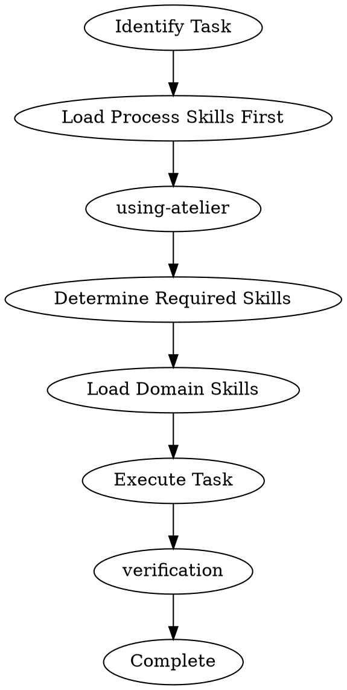

# Spec-Driven Development Methodology

This plugin combines three innovations: AgentOS context layers and delegation, OpenSpec living specifications, and Beads dependency tracking—with Superpowers integration for enhanced workflow quality.

## Superpowers Integration

This methodology integrates Superpowers workflow patterns to enforce quality gates and evidence-based verification:

| Superpower Skill | Purpose | When to Use |
|------------------|---------|-------------|
| **using-atelier** | Skill invocation governance | Before responding, load relevant skills |
| **brainstorming** | Explore requirements before building | When creating new features |
| **research** | Understand codebase before planning | Before technical design |
| **planning** | Create implementation plans | After design, before implementation |
| **subagent-driven-development** | Execute tasks with subagents | For implementation with review |
| **parallel-execution** | Run independent tasks in parallel | For multiple independent changes |
| **verification** | Evidence-based completion claims | Before marking anything done |

### Skill Invocation Flow



**Process skills before domain skills** - Always load the relevant process skills first (using-atelier, planning, verification) before domain-specific skills (product, architect, testing).

## 3-Layer Context Model (AgentOS)

Rather than overwhelming agents with all knowledge at once, provide contextually relevant information at the right moments:

| Layer | Contains | Purpose | Location |
|-------|----------|---------|----------|
| **Standards** | Coding conventions, architecture patterns | How you build | `docs/standards/` |
| **Product** | Mission, users, roadmap | What and why | `docs/product/` |
| **Specs** | Requirements, design, tasks | What to build next | `docs/spec/<feature>/` |

Agents load only the context layer they need for their current task.

## Workflow Phases (AgentOS)

| AgentOS Phase | Our Command | Agents Used |
|---------------|-------------|-------------|
| Plan Product | (manual) | - |
| Shape Spec | `/spec:create` | clerk → oracle |
| Write Spec | `/spec:create` | architect → clerk |
| Create Tasks | `/spec:create` | architect (Beads) |
| Implement Tasks | `/spec:work` | direct implementation |
| Orchestrate Tasks | `/spec:work` | architect delegation |

## Orchestrated Delegation

Commands delegate to specialized subagents with controlled context:

| Agent | Model | Role |
|-------|-------|------|
| **clerk** | haiku | Fast context retrieval, file scaffolding |
| **oracle** | opus | Requirements interviews, strategic analysis |
| **architect** | opus | Technical design, task breakdown |

Pattern: Primary agent delegates to specialized subagents rather than trying to do everything itself.

## Living Specifications (OpenSpec)

**Core principle**: Align humans and AI on what to build before any code is written.

### Spec Format

- Requirements with SHALL/MUST language
- Scenarios as acceptance criteria
- Hierarchical: Requirements contain nested Scenarios

### Directory Structure

- `docs/spec/<feature>/spec.md` - Source of truth
- `docs/changes/<feature>/<change>/` - Proposed changes (proposal.md, delta.md, tasks.md)

### Delta Format (Brownfield Changes)

- **ADDED** Requirements - New capabilities
- **MODIFIED** Requirements - Altered behavior (complete updated text)
- **REMOVED** Requirements - Deprecated features

### Living Spec Cycle

1. Draft change proposal
2. Review until consensus
3. Implement tasks
4. Archive change, merge delta into spec

## Dependency Tracking (Beads)

Beads enforces implementation order through dependencies:

- `bd ready` surfaces next unblocked task
- Dependencies enforce bottom-up implementation (Entity → Repository → Service → Router)
- Git-backed persistence via `.beads/beads.jsonl`

Commands like `/spec:create` automatically create Beads epics with tasks ordered by technical dependencies.

## Hard Gates

Non-negotiable quality gates that must pass before proceeding:

| Gate | Rule | Fail Action |
|------|------|-------------|
| **Requirements** | Load product skill before gathering requirements | Stop, load skill, restart |
| **Design** | Load architect skill before technical design | Stop, load skill, restart |
| **Testing** | Load testing skill before implementation | Stop, load skill, restart |
| **Verification** | Evidence before completion claims | Run verification, show results |
| **Root Cause** | Investigate before fixing bugs | Identify cause, then fix |

**Iron Laws:**
- NO PRODUCTION CODE WITHOUT A FAILING TEST (Testing skill)
- NO FIXES WITHOUT ROOT CAUSE INVESTIGATION FIRST (Challenge skill)
- EVIDENCE BEFORE ASSERTIONS (Verification skill)
- NO ASSUMPTIONS WITHOUT VALIDATION (Product skill)

## Red Flags

Warning signs you're about to skip a quality gate:

| Pattern | What It Means | Fix |
|---------|---------------|-----|
| "I know what I'm doing" | Rationalization, skip verification | Load verification skill |
| "It's probably fine" | No evidence | Run tests, show output |
| "I don't need a test for this" | Skip TDD | Write test first |
| "I'll figure it out as I go" | Skip planning | Create plan first |
| "It's a simple change" | Skip product discovery | Load product skill |
| "I already know the codebase" | Skip research | Research anyway |

## Verification Requirements

Before claiming any work is complete, verify and document:

| Verification | Required Evidence |
|--------------|-------------------|
| Tests | Actual test output (passed/failed counts) |
| Linting | Linter output (0 errors) |
| Type Check | Type checker output (0 errors) |
| Manual Test | Steps taken + results |
| Code Review | Review feedback (if required) |

## Domain Boundary Testing

Testing philosophy that aligns with layered architecture:

### The Principle

**Domain boundaries define test boundaries** - Test at the boundaries between components, mock at boundaries.

### The Layers

```
┌─────────────────────────────────────────┐
│           Effectful Edge (IO)           │
│  Router, Repository, Client, Producer   │
└─────────────────────────────────────────┘
                    │
              TEST BOUNDARY
                    │
┌─────────────────────────────────────────┐
│          Functional Core (Pure)          │
│          Service, Entity                │
└─────────────────────────────────────────┘
```

### What to Test

| Layer | Test Type | What to Assert |
|-------|-----------|----------------|
| Entity | Unit | Validation, business rules, transforms |
| Service | Unit | Orchestration logic, error handling |
| Router | Integration | HTTP status, response format |
| Repository | Integration | Database operations |
| Client | Integration | External API calls |

### Mocking at Boundaries

- **Mock external systems** - APIs, databases, file system
- **Mock services from edge** - Stub Router, Repository when testing core
- **Test core for real** - Entity and Service have no dependencies
- **Don't mock inside core** - Entity and Service are pure

This ensures tests verify behavior, not implementation details.
